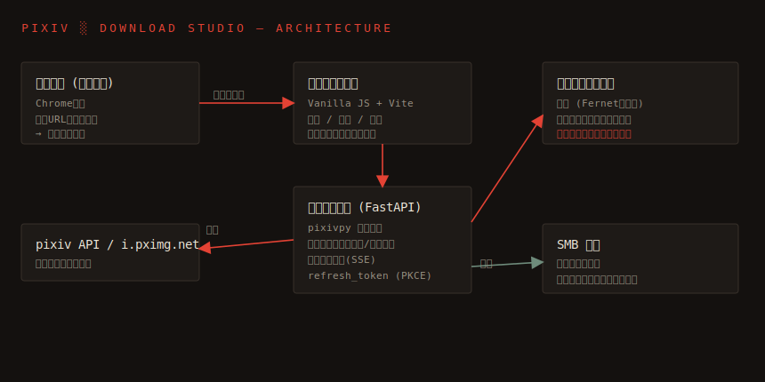

# PIXIV ░ DOWNLOAD STUDIO

[](LICENSE)
[](https://github.com/HYDE-Systems/pixiv-downloader/actions/workflows/docker-publish.yml)
[](https://github.com/HYDE-Systems/pixiv-downloader/releases)

pixiv の作品をブラウザから一括収集し、**SMB 共有へ直接ストリーム保存**する、暗室スタジオ風のセルフホスト型ダウンロードダッシュボードです。サーバー（コンテナ）には作品データもキャッシュも一切残しません。

- バックエンド: FastAPI + [pixivpy](https://github.com/upbit/pixivpy)
- フロントエンド: Vanilla JS + Vite（暗室スタジオUI）
- 連携: Chrome 拡張機能（複数タブを一括でキューへ投入）
- 保存先: SMB（メモリ経由のストリーム書込み。ローカルディスク不使用）
- 設定: すべてダッシュボード内で完結し、暗号化して永続化



## 特長

- **画像・作品ダウンロード**（必須機能）: 複数ページ作品・うごイラ(zip)・メタデータ(JSON)に対応。**作品ごとに ZIP 化**して保存するオプションあり
- **ダッシュボード内認証**: pixiv の `refresh_token` を PKCE フローで取得（リダイレクト URL を貼るだけで `code` を自動抽出）、または直接貼り付け
- **ライブ監視**: ダウンロードキューをフィルムストリップとして SSE でリアルタイム表示
- **作品検索**: タグ・キーワード検索からコンタクトシートで直接キューへ送信。サムネイルクリックで詳細ポップアップ（大プレビュー・複数ページ切替）
- **RSSフィード**: 作家の新着・タグ/検索・フォロー新着をRSS化し、お好みのRSSリーダーで購読（`?token=` 認証）
- **Chrome 拡張**: 開いている対応タブ（作品/作家ページ）を検出し、ワンクリックで一括キュー投入。右クリックメニューにも対応
- **ログインゲート**: API トークンでダッシュボードにログインし、HttpOnly Cookie で認証を保持
- **SMB 直結**: 設定した共有へストリーム書込み。サーバーに永続データを残さない
- **暗号化永続化**: 設定とキューのみを Fernet で暗号化し、Docker ボリュームに保存

## 必要要件

- Docker / Docker Compose
- アクセス可能な SMB 共有（SMB2/3）
- pixiv アカウント

## 使い方

公開イメージは GitHub Container Registry (GHCR) で配布しています。

- `ghcr.io/hyde-systems/pixiv-downloader-backend`
- `ghcr.io/hyde-systems/pixiv-downloader-frontend`

### A. Docker Compose（推奨）

```bash
git clone https://github.com/HYDE-Systems/pixiv-downloader.git
cd pixiv-downloader
cp .env.example .env       # 必要に応じてポート・再起動ポリシー・MASTER_PASSWORD を設定

# 公開イメージを利用する場合
docker compose pull
docker compose up -d

# ソースからビルドする場合
docker compose up -d --build
```

ブラウザで `http://localhost:8080`（既定）を開きます。停止は `docker compose down`。

### B. Docker run

Compose を使わない場合は、共有ネットワーク上で 2 コンテナを起動します。
フロントエンドの nginx は `backend:8000` へプロキシするため、**バックエンドのコンテナ名は `backend`** にしてください。

```bash
# 1) ネットワークと永続ボリュームを作成
docker network create pixiv-net
docker volume create pixiv_data

# 2) バックエンド（設定・キューのみ暗号化保存。作品データはSMBへ）
docker run -d --name backend \
  --network pixiv-net \
  --restart unless-stopped \
  -v pixiv_data:/data \
  ghcr.io/hyde-systems/pixiv-downloader-backend:latest

# 3) フロントエンド（ダッシュボード）
docker run -d --name frontend \
  --network pixiv-net \
  --restart unless-stopped \
  -p 8080:80 \
  ghcr.io/hyde-systems/pixiv-downloader-frontend:latest
```

ブラウザで `http://localhost:8080` を開きます。

### 再起動ポリシー

コンテナの自動再起動を指定できます（[Docker のドキュメント](https://docs.docker.com/engine/containers/start-containers-automatically/)）。

| ポリシー | 挙動 |
|----------|------|
| `no` | 自動再起動しない |
| `on-failure` | 異常終了時のみ再起動 |
| `always` | 常に再起動（手動停止後も Docker 起動時に再開） |
| `unless-stopped`（既定） | 手動停止した場合を除き常に再起動 |

- **Compose**: `.env` の `RESTART_POLICY` で指定（既定 `unless-stopped`）。
- **docker run**: `--restart <policy>` を指定（例 `--restart always`）。稼働中コンテナの変更は `docker update --restart always backend frontend`。

### 初回ログイン

ダッシュボードは API トークンでログインします。**初回トークンはバックエンドのログに出力**されます。

```bash
docker compose logs backend | grep トークン   # Compose の場合
docker logs backend | grep トークン            # docker run の場合
```

### 初期設定の流れ

1. **ダッシュボードにログイン**: 上記で取得した API トークンを入力（認証は Cookie に保持されます）。
2. **認証タブ**: 「ログインURLを開く」→ pixiv でログイン → リダイレクト URL を貼り付け（`code` 自動抽出）→ refresh_token を取得。
   既に `refresh_token` を持っている場合は方法 B で直接入力。
3. **設定タブ**: SMB のホスト・共有名・認証情報・保存ベースパスを入力し、「接続テスト」で確認。
4. **設定タブ**: ファイル名テンプレート・メタデータ保存・**作品ごと ZIP 化**などのダウンロード設定を調整。
5. **検索タブ** または **Chrome 拡張** から作品をキューへ投入し、**受信タブ**で進捗を監視。RSS は **RSS タブ**でフィード URL を生成。

### ファイル名テンプレート

使用可能なトークン:

```
{artist} {artist_id} {title} {illust_id} {page} {ext} {date}
```

既定:

```
{artist} ({artist_id})/{illust_id}_{title}_p{page}.{ext}
```

## Chrome 拡張機能

`extension/` ディレクトリを Chrome の「パッケージ化されていない拡張機能を読み込む」で読み込みます。

1. `chrome://extensions` → デベロッパーモード ON → 「パッケージ化されていない拡張機能を読み込む」→ `extension/` を選択。
2. 拡張のオプションで **ダッシュボードURL**（例 `http://localhost:8080`）と **API トークン**（ダッシュボード設定タブで発行）を入力。
3. pixiv の作品・作家ページを複数タブで開き、拡張アイコンから「一括でキューに送る」。
   右クリックメニューからリンク単体・全タブ一括の追加も可能。

## ログイン・アクセス制御

- ダッシュボードは **API トークンでログイン**します。認証は **HttpOnly Cookie** に保存され、再読込してもログイン状態が維持されます（サイドレールの「ロック」で解除）。
- **初回トークンはバックエンドのログに出力**されます。取得方法：
  ```bash
  docker compose logs backend | grep トークン
  ```
- 設定タブでトークンの確認・再生成ができます（再生成すると Cookie・拡張機能・RSS購読URLの再設定が必要）。
- RSS は外部リーダー向けに URL の `?token=` で認証します（Cookie 不可のため）。

## データの扱い・セキュリティ

- 作品データは **pixiv → コンテナのメモリ → SMB** とストリームされ、コンテナのディスクには書き込まれません。
- 永続化されるのは **設定** と **キューのスナップショット** のみで、いずれも Fernet で暗号化されます。
- 暗号鍵は `MASTER_PASSWORD`（任意）から導出するか、未指定時はボリューム内に自動生成されます。
- 全API（RSS フィードと画像プロキシを除く）は Cookie または `X-API-Token` ヘッダで保護されます。拡張機能はヘッダで認証します。
- Cookie には Secure 属性を付けていません（HTTP の LAN 運用を想定）。HTTPS 公開時はリバースプロキシ等で TLS を終端してください。

## 開発

各サービスは Docker コンテナ内で実行します。

```bash
docker compose up -d --build      # 起動
docker compose logs -f backend    # ログ
docker compose down               # 停止
```

## ライセンス

[MIT License](LICENSE) © 2026 HYDE-Systems

## 注意

個人利用向けのツールです。pixiv の利用規約および各作品の権利を尊重してご利用ください。本ソフトウェアは現状有姿で提供され、利用に伴う責任は利用者が負います。
